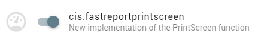

<div class="slidetext-bg">

### Turn up the jam



<div class="fragment">

```pascal
class procedure TfrmMain.Printscreen;
begin
  if Unleash.IsEnabled('cis.fastreportprintscreen') then
    FastReportPrintscreen
  else
    OldBrokenPrintscreen;
end;
```

</div>

</div>
